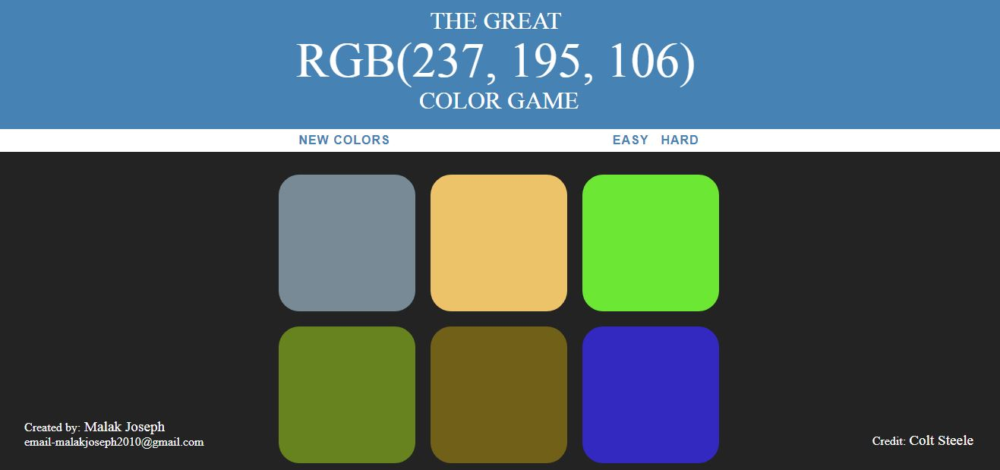

# Color Game

## Table of Contents
* [About the Project](#about-the-project)
* [How to Play](#how-to-play)
* [Steps to run the Project](#steps-to-run-the-project)
* [Credits](#credits)
* [License](#license)

### About the Project
* This is a great guessing game based on RGB color model to keep your mind sharp.
* Two modes included.

### How to Play
* Guess the nearest correct color based on the numbers of the RGB color model.
* ***Hint***: Pick the most two colors with numbers and try to compine them to make the correct one!

### Steps to run the Project
You can visit the live demo [here](https://malakjoseph.github.io/color-game/).

### Credits
All credits go to ***Colt Steele*** from [The Web Developer Boot Camp](https://www.udemy.com/the-web-developer-bootcamp/).

### License
This project is licensed under the terms of the MIT license.
